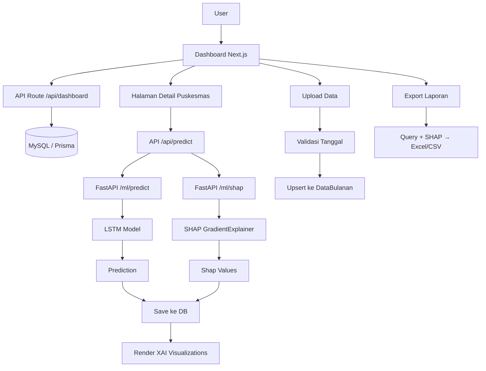
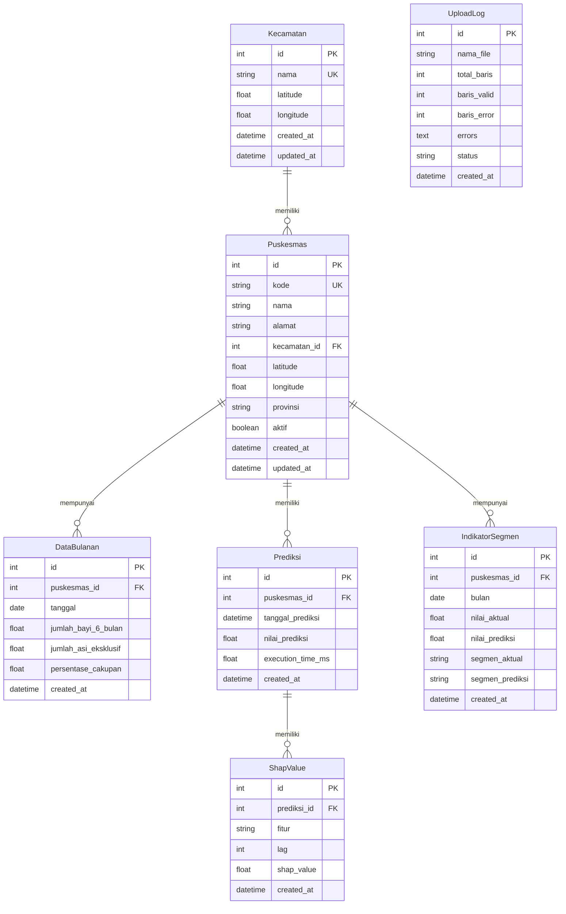

# Sistem Prediksi ASI Eksklusif + XAI Panel LSTM

**Prediksi Cakupan ASI Eksklusif 24 Puskesmas — Kota Padang, Sumatera Barat**

Sebuah sistem prediksi time-series berbasis **LSTM Panel (Multi-Station)** yang dilengkapi **XAI (Explainable AI) SHAP** untuk memberikan interpretasi kontribusi setiap fitur terhadap hasil prediksi.

---

## Daftar Isi

- [Tentang Proyek](#tentang-proyek)
- [Metode & Algoritma](#metode--algoritma)
- [Data](#data)
- [Arsitektur Sistem](#arsitektur-sistem)
- [ERD (Entity Relationship Diagram)](#erd-entity-relationship-diagram)
- [App Flow](#app-flow)
- [Feature Engineering](#feature-engineering)
- [Training Plan](#training-plan)
- [XAI Pipeline (SHAP)](#xai-pipeline-shap)
- [Tech Stack](#tech-stack)
- [Struktur Folder](#struktur-folder)
- [Cara Setup (Untuk Clone)](#cara-setup-untuk-clone)
- [Mode Menjalankan](#mode-menjalankan)

---

## Tentang Proyek

Proyek ini membangun **Web Application Premium** yang memprediksi persentase cakupan ASI Eksklusif di **24 Puskesmas** se-Kota Padang menggunakan model **LSTM Panel** yang telah ditraining sebelumnya.

### Domain & Cakupan

| Item | Detail |
|------|--------|
| **Domain** | Health Analytics — Program Gizi ASI Eksklusif |
| **Wilayah** | Kota Padang, Sumatera Barat |
| **Kecamatan** | 11 Kecamatan |
| **Puskesmas** | 24 Puskesmas |
| **Periode Data** | 2021–2024 (48 bulan) |
| **Target Prediksi** | Persentase Cakupan ASI Eksklusif |

### Daftar 11 Kecamatan

| # | Kecamatan | Jumlah Puskesmas |
|---|-----------|-----------------|
| 1 | Koto Tangah | 5 |
| 2 | Padang Utara | 3 |
| 3 | Kuranji | 3 |
| 4 | Padang Timur | 2 |
| 5 | Padang Barat | 1 |
| 6 | Padang Selatan | 3 |
| 7 | Lubuk Begalung | 2 |
| 8 | Lubuk Kilangan | 1 |
| 9 | Nanggalo | 2 |
| 10 | Pauh | 1 |
| 11 | Bungus Teluk Kabung | 1 |

### Daftar 24 Puskesmas

| Kode | Nama | Kecamatan |
|------|------|-----------|
| PKM01 | AIR DINGIN | Koto Tangah |
| PKM02 | ANAK AIR | Koto Tangah |
| PKM03 | IKUR KOTO | Koto Tangah |
| PKM04 | LB.BUAYA | Koto Tangah |
| PKM05 | TUNGGUL HITAM | Koto Tangah |
| PKM06 | AMBACANG | Kuranji |
| PKM07 | BELIMBING | Kuranji |
| PKM08 | KURANJI | Kuranji |
| PKM09 | LUBUK BEGALUNG | Lubuk Begalung |
| PKM10 | PEGAMBIRAN | Lubuk Begalung |
| PKM11 | LUBUK KILANGAN | Lubuk Kilangan |
| PKM12 | LAPAI | Nanggalo |
| PKM13 | NANGGALO | Nanggalo |
| PKM14 | PADANG PASIR | Padang Barat |
| PKM15 | PEMANCUNGAN | Padang Selatan |
| PKM16 | RAWANG | Padang Selatan |
| PKM17 | SEBERANG PADANG | Padang Selatan |
| PKM18 | ANDALAS | Padang Timur |
| PKM19 | PARAK KARAKAH | Padang Timur |
| PKM20 | AIR TAWAR | Padang Utara |
| PKM21 | ALAI | Padang Utara |
| PKM22 | ULAK KARANG | Padang Utara |
| PKM23 | BUNGUS | Bungus Teluk Kabung |
| PKM24 | PAUH | Pauh |

---

## Metode & Algoritma

### LSTM Panel (Multi-Station)

Model menggunakan **GRU (Gated Recurrent Unit)** — varian LSTM yang lebih ringan — dengan arsitektur:

```
Input (batch, 12, 7)
  └─ GRU(64, return_sequences=True, dropout=0.2)
       └─ GRU(32, dropout=0.2)
            └─ Dense(16, activation='relu')
                 └─ Dropout(0.2)
                      └─ Dense(1)  → output prediksi
```

| Parameter | Nilai |
|-----------|-------|
| **Window Size** | 12 bulan |
| **N Features** | 7 fitur |
| **Optimizer** | Adam (lr=0.003) |
| **Loss** | MSE |
| **Metrics** | MAE, R² |
| **Batch Size** | 16 |
| **Epochs** | 300 (dengan EarlyStopping) |
| **EarlyStopping** | Patience 50, restore best weights |
| **ReduceLROnPlateau** | Factor 0.5, patience 15, min_lr 1e-6 |
| **Target R²** | > 0.80 per Puskesmas |

### Sliding Window Approach

Setiap prediksi menggunakan **12 bulan terakhir** sebagai input (sliding window). Data per Puskesmas dibentuk menjadi sequence:

```
[t0,  t1,  ..., t11] → predict t12
[t1,  t2,  ..., t12] → predict t13
...
```

---

## Data

### Dataset Historis

| Sumber | File | Periode | Jumlah Baris |
|--------|------|---------|-------------|
| Data Master | `data_master_2021_2024.csv` | Jan 2021 – Des 2024 | 1.153 baris |
| Data Uji | `data_uji_2026.csv` | 2026 | Untuk validasi |

### Fitur Input (7 fitur)

| # | Fitur | Keterangan | Tipe |
|---|-------|-----------|------|
| 1 | `Jumlah_Bayi_6_Bulan` | Jumlah bayi 6 bulan (normalized 0–1) | Numerik |
| 2 | `Jumlah_ASI_Eksklusif` | Jumlah bayi ASI eksklusif (normalized 0–1) | Numerik |
| 3 | `Lag1_Target` | Persentase cakupan t-1 | Numerik |
| 4 | `Lag2_Target` | Persentase cakupan t-2 | Numerik |
| 5 | `Lag3_Target` | Persentase cakupan t-3 | Numerik |
| 6 | `Month_Sin` | Encode siklus tahunan (sin) | Numerik (-1 s.d 1) |
| 7 | `Month_Cos` | Encode siklus tahunan (cos) | Numerik (-1 s.d 1) |

### Target

| Fitur | Satuan | Rentang |
|-------|--------|---------|
| `Persentase_Cakupan` | Persen (%) | 0–100 |

---

## Arsitektur Sistem

```
┌──────────────────────────────────────────────────────────────────────────────┐
│                         CLIENT LAYER (Next.js 14+)                           │
│  TypeScript · Tailwind CSS · Framer Motion · Recharts · Leaflet Map          │
│  Glassmorphism UI · Dark Mode · SHAP Force Plot · Animated Components        │
└─────────────────────────────┬────────────────────────────────────────────────┘
                              │ HTTP / JSON
┌─────────────────────────────▼────────────────────────────────────────────────┐
│                      API LAYER (Next.js Route Handlers)                       │
│  Server Actions · Zod Validation · Rate Limiting · Prisma Client             │
│  Routes: /api/dashboard, /api/puskesmas, /api/history,                       │
│          /api/predict, /api/upload, /api/export                               │
└────────────────┬────────────────────────────────────┬────────────────────────┘
                 │                                    │
┌────────────────▼──────────────┐   ┌─────────────────▼────────────────────────┐
│     DATABASE LAYER (MySQL)    │   │     ML / XAI ENGINE (FastAPI)            │
│  ┌─────────────────────────┐  │   │  ┌───────────────────────────────────┐  │
│  │ Kecamatan (11)          │  │   │  │ POST /ml/predict                  │  │
│  │ Puskesmas (24)          │  │   │  │ POST /ml/shap                     │  │
│  │ DataBulanan (1153+)     │  │   │  │ GET  /ml/health                   │  │
│  │ Prediksi                │  │   │  └───────────────────────────────────┘  │
│  │ ShapValue               │  │   │  ┌───────────────────────────────────┐  │
│  │ UploadLog               │  │   │  │ TensorFlow · SHAP · NumPy         │  │
│  │ IndikatorSegmen         │  │   │  │ model_lstm_panel.keras            │  │
│  └─────────────────────────┘  │   │  │ scaler_X.pkl · scaler_Y.pkl       │  │
└───────────────────────────────┘   │  │ background_data.npy (200 samples)  │  │
                                    │  └───────────────────────────────────┘  │
                                    └─────────────────────────────────────────┘
```

### Diagram Alur Data (Mermaid)



---

## ERD (Entity Relationship Diagram)



### Relasi Antar Tabel

| Tabel Utama | Relasi | Tabel Terkait | Key |
|-------------|--------|---------------|-----|
| `Kecamatan` | 1 → N | `Puskesmas` | `kecamatan_id` |
| `Puskesmas` | 1 → N | `DataBulanan` | `puskesmas_id` |
| `Puskesmas` | 1 → N | `Prediksi` | `puskesmas_id` |
| `Puskesmas` | 1 → N | `IndikatorSegmen` | `puskesmas_id` |
| `Prediksi` | 1 → N | `ShapValue` | `prediksi_id` |

### Unique Constraints

- `DataBulanan`: unique `[puskesmas_id, tanggal]` — tidak boleh duplikat data per bulan
- `ShapValue`: unique `[prediksi_id, fitur, lag]` — setiap fitur-lag unik per prediksi
- `IndikatorSegmen`: unique `[puskesmas_id, bulan]`

### Indexes

- `DataBulanan`: composite index `[puskesmas_id, tanggal]`
- `Prediksi`: index `[puskesmas_id]`
- `ShapValue`: index `[prediksi_id]`
- `IndikatorSegmen`: index `[puskesmas_id, bulan]`

---

## App Flow

### Alur Aplikasi (Mermaid)

```mermaid
flowchart TD
    START([User Membuka Aplikasi]) --> DASH[Dashboard]
    DASH --> STAT[Lihat Stat Cards]
    DASH --> TREND[Lihat Tren 48 Bulan]
    DASH --> TABLE[Lihat Tabel Puskesmas]

    TABLE --> DETAIL[Klik Detail Puskesmas]
    DETAIL --> HIST[Lihat Histori 48 Bulan]
    DETAIL --> PRED[Klik Prediksi Sekarang]

    PRED --> FETCH_HIST[Fetch Data 12 Bulan Terakhir]
    FETCH_HIST --> BUILD_INPUT[Bentuk Tensor 3D<br/>(1, 12, 7)]
    BUILD_INPUT --> CALL_ML[POST /ml/predict]
    CALL_ML --> SCALE_X[MinMaxScaler.transform]
    SCALE_X --> INFER[Model.predict]
    INFER --> INV_SCALE[scaler_Y.inverse_transform]
    INV_SCALE --> SAVE_PRED[Simpan Prediksi ke DB]

    SAVE_PRED --> CALL_SHAP[POST /ml/shap]
    CALL_SHAP --> SHAP_CALC[SHAP GradientExplainer]
    SHAP_CALC --> FORMAT_SHAP[Format 3D Array → JSON]
    FORMAT_SHAP --> SAVE_SHAP[Simpan ShapValue ke DB]
    SAVE_SHAP --> RENDER[Render XAI Visualizations]
    RENDER --> FORCE[SHAP Force Plot]
    RENDER --> SUMMARY[SHAP Summary Bar]
    RENDER --> TIMELINE[SHAP Feature Timeline]
    RENDER --> INTERP[Interpretation Card]

    DASH --> UPLOAD[Halaman Upload]
    UPLOAD --> DROP[Drop CSV/XLSX]
    DROP --> VALIDATE[Validasi Format & Tanggal]
    VALIDATE --> PREVIEW[Tampilkan Preview]
    PREVIEW --> APPEND[Append ke DataBulanan]
    APPEND --> LOG[Simpan UploadLog]

    DASH --> EXPORT[Halaman Laporan]
    EXPORT --> FILTER[Filter Tanggal & Puskesmas]
    FILTER --> GEN_EXPORT[Generate Excel/CSV]
    GEN_EXPORT --> DOWNLOAD[Download File]

    DASH --> PETA[Halaman Peta]
    PETA --> MAP[Lihat Peta Interaktif Leaflet]
    MAP --> KLUSTER[Cluster per Kecamatan]
    KLUSTER --> SEGMEN[Warna Berdasarkan Segmen]
```

---

## Feature Engineering

Proses transformasi data mentah CSV menjadi 7 fitur input LSTM:

```mermaid
flowchart LR
    CSV[(CSV Mentah)] --> FE[Feature Engineering]
    FE --> F1[Jumlah_Bayi_6_Bulan]
    FE --> F2[Jumlah_ASI_Eksklusif]
    FE --> L1[Lag1_Target]
    FE --> L2[Lag2_Target]
    FE --> L3[Lag3_Target]
    FE --> MS[Month_Sin]
    FE --> MC[Month_Cos]
    F1 --> SCALE[MinMaxScaler<br/>per fitur global]
    F2 --> SCALE
    L1 --> SCALE
    L2 --> SCALE
    L3 --> SCALE
    MS --> SCALE
    MC --> SCALE
    SCALE --> TENSOR[Reshape ke (1, 12, 7)]
    TENSOR --> PREDICT[Model LSTM]
```

**Proses Detail:**

1. **Load CSV** — baca `data_master_2021_2024.csv` dengan kolom: Tanggal, Kecamatan, Puskesmas, Jumlah_Bayi_6_Bulan, Jumlah_ASI_Eksklusif, Persentase_Cakupan
2. **Sort** — urutkan per Puskesmas berdasarkan Tanggal ascending
3. **Seasonal Encoding** — dari kolom Month (1–12) hitung `sin(2π*month/12)` dan `cos(2π*month/12)`
4. **Lag Features** — untuk setiap Puskesmas, shift target `Persentase_Cakupan` sebanyak 1, 2, 3 bulan ke belakang
5. **Drop NaN** — buang baris yang tidak memiliki lag (3 bulan pertama per Puskesmas)
6. **MinMax Scaling** — scaling global (semua Puskesmas) untuk 7 fitur dan target secara terpisah
7. **Sliding Window** — bentuk sequence panjang 12 bulan dengan stride 1

---

## Training Plan

### Strategi Training

1. **Data Preparation**
   - Load CSV 2021–2024 (1.153 baris)
   - Feature engineering: 7 fitur (3 original + 3 lag + 2 seasonal)
   - MinMaxScaler global (fitur X dan target Y)
   - Sliding window sequence: (n_sequences, 12, 7)

2. **Data Splitting (Sequential per Puskesmas)**
   - **80%** data awal per Puskesmas → Training set
   - **20%** data akhir per Puskesmas → Validation set
   - Tidak ada shuffle — menjaga urutan temporal

3. **Training Configuration**
   - GRU-based LSTM dengan 2 layer
   - EarlyStopping: patience 50, monitor val_loss
   - ReduceLROnPlateau: factor 0.5, patience 15
   - Max epochs: 300

4. **Evaluation Metrics per Puskesmas**
   - R² Score (target > 0.80)
   - MAE (Mean Absolute Error)
   - MAPE (Mean Absolute Percentage Error)
   - RMSE

### Cara Eksekusi Training

```bash
cd ml-engine
.\venv\Scripts\python training\retrain.py
```

Script akan:
- Memuat dan memproses data dari `data_master_2021_2024.csv`
- Melakukan feature engineering (7 fitur + lag)
- Scaling dengan MinMaxScaler
- Split sequential 80/20 per Puskesmas
- Training GRU-LSTM dengan EarlyStopping
- Evaluasi per Puskesmas (R², MAE)
- Menyimpan model, scaler, dan background_data untuk SHAP

### Output Training

| File | Lokasi | Deskripsi |
|------|--------|-----------|
| `model_lstm_panel.keras` | `ml-engine/models/` | Model terlatih (format Keras v3) |
| `model_lstm_panel.h5` | `ml-engine/models/` | Model terlatih (format H5) |
| `scaler_X.pkl` | `ml-engine/models/` | MinMaxScaler untuk 7 fitur input |
| `scaler_Y.pkl` | `ml-engine/models/` | MinMaxScaler untuk target |
| `background_data.npy` | `ml-engine/models/` | 200 sampel background untuk SHAP |
| `training_history.json` | `ml-engine/models/` | Ringkasan metrik training |

---

## XAI Pipeline (SHAP)

### Alur SHAP

```mermaid
flowchart TD
    TENSOR[Input Tensor<br/>(1, 12, 7)] --> EXPLAINER[SHAP GradientExplainer]
    BG[Background Data<br/>200 samples] --> EXPLAINER
    EXPLAINER --> SHAP_OUT[SHAP Values Array<br/>Shape: (1, 12, 7)]
    SHAP_OUT --> MAP[Mapping per Fitur + Lag]
    MAP --> F1[Jumlah_Bayi_6_Bulan<br/>lag t-1 sd t-12]
    MAP --> F2[Jumlah_ASI_Eksklusif<br/>lag t-1 sd t-12]
    MAP --> F3[Lag1_Target<br/>lag t-1 sd t-12]
    MAP --> F4[Lag2_Target<br/>lag t-1 sd t-12]
    MAP --> F5[Lag3_Target<br/>lag t-1 sd t-12]
    MAP --> F6[Month_Sin<br/>lag t-1 sd t-12]
    MAP --> F7[Month_Cos<br/>lag t-1 sd t-12]
    F1 --> RESPONSE[JSON Response]
    F2 --> RESPONSE
    F3 --> RESPONSE
    F4 --> RESPONSE
    F5 --> RESPONSE
    F6 --> RESPONSE
    F7 --> RESPONSE
    RESPONSE --> FORCE[Force Plot]
    RESPONSE --> SUMMARY[Summary Bar]
    RESPONSE --> TIMELINE[Feature Timeline]
    RESPONSE --> INTERP[Interpretation Text]

    CHECK{sum(SHAP) + expected_value<br/>≈ predicted_value?}
    SHAP_OUT --> CHECK
    CHECK -- Yes --> VALID[✓ Consistent]
    CHECK -- No --> WARN[⚠ Warning]
```

### Detail SHAP

| Parameter | Nilai |
|-----------|-------|
| **Explainer** | SHAP GradientExplainer |
| **Background** | 200 sampel random dari training set |
| **Input Shape** | (1, 12, 7) — batch=1, timesteps=12, features=7 |
| **Output Shape** | (1, 12, 7) — kontribusi per fitur per lag |
| **Expected Value** | Rata-rata prediksi atas background data |
| **Consistency Check** | sum(SHAP) + expected_value ≈ prediction (tolerance 0.01) |

### Format Response SHAP

```json
{
  "success": true,
  "puskesmas_id": 1,
  "expected_value": 65.32,
  "features": [
    {
      "feature": "Jumlah_ASI_Eksklusif",
      "mean_abs_impact": 3.45,
      "impacts": [
        { "lag": 12, "shap_value": 2.15, "feature_name": "Jumlah_ASI_Eksklusif" },
        { "lag": 11, "shap_value": -1.23, "feature_name": "Jumlah_ASI_Eksklusif" },
        ...
      ]
    },
    ...
  ]
}
```

### Visualisasi SHAP di Frontend

| Komponen | Tipe Grafik | Fungsi |
|----------|------------|--------|
| `ShapForcePlot` | Force Plot horizontal | Menunjukkan kontribusi kumulatif dari base value ke output |
| `ShapSummaryBar` | Horizontal bar chart | Rata-rata absolut kontribusi per fitur (feature importance) |
| `ShapFeatureTimeline` | Vertical bar chart per fitur | Kontribusi setiap fitur di 12 lag waktu |
| `InterpretationCard` | Teks narasi | Deskripsi bahasa alami: "Fitur X pada lag Y menaikkan prediksi Z%" |

### Skema Warna SHAP

| Kontribusi | Warna | Makna |
|-----------|-------|-------|
| Positif (↑ prediksi) | `#10b981` (Emerald) | Menaikkan prediksi cakupan |
| Negatif (↓ prediksi) | `#3b82f6` (Blue) | Menurunkan prediksi cakupan |

---

## Tech Stack

### Frontend

| Teknologi | Versi | Fungsi |
|-----------|-------|--------|
| Next.js 14 (App Router) | ^14.2.35 | Full-stack framework |
| TypeScript | ^5.9.3 | Type safety strict |
| Tailwind CSS | ^3.4.19 | Utility-first styling |
| Framer Motion | ^12.42.2 | Animasi premium |
| Recharts | ^3.9.2 | Chart & grafik |
| Leaflet + react-leaflet | ^1.9.4 / ^4.2.1 | Peta interaktif |
| @phosphor-icons/react | ^2.1.10 | Icon set |
| date-fns | ^4.4.0 | Manipulasi tanggal |
| html2canvas + jsPDF | ^1.4.1 / ^4.2.1 | Export PDF |

### Backend & Database

| Teknologi | Versi | Fungsi |
|-----------|-------|--------|
| Next.js Route Handlers | 14 | API layer |
| Prisma ORM | ^5.22.0 | Database ORM |
| MySQL 8 | 8.x | Database relasional |
| Zod | ^3.25.76 | Validasi schema |

### ML Engine (Python)

| Teknologi | Versi | Fungsi |
|-----------|-------|--------|
| FastAPI | 0.111.0 | REST API microservice |
| Uvicorn | 0.30.1 | ASGI server |
| TensorFlow | 2.16.1 | Deep learning framework |
| SHAP | 0.51.0 | Explainable AI |
| NumPy | 1.26.4 | Numerical computing |
| Pandas | 2.2.2 | Data manipulation |
| scikit-learn | 1.9.0 | Scaler & metrics |
| joblib | 1.4.2 | Model serialization |

---

## Struktur Folder

```
├── .env                          # Environment variables
├── .opencode/                    # OpenCode AI config
├── AGENTS.md                     # Multi-agent configuration
├── PRD.md                        # Product Requirement Document
├── package.json                  # Node.js dependencies
├── tsconfig.json                 # TypeScript configuration
├── tailwind.config.js            # Tailwind CSS configuration
├── next.config.js                # Next.js configuration
│
├── src/
│   ├── app/
│   │   ├── layout.tsx            # Root layout (Inter font, ThemeProvider)
│   │   ├── globals.css           # Global styles + CSS variables
│   │   ├── (dashboard)/
│   │   │   ├── layout.tsx        # Dashboard layout (sidebar, navbar)
│   │   │   ├── page.tsx          # Dashboard utama (stat, chart, tabel)
│   │   │   ├── puskesmas/
│   │   │   │   └── [id]/
│   │   │   │       └── page.tsx  # Detail Puskesmas + Prediksi + XAI
│   │   │   ├── upload/
│   │   │   │   └── page.tsx      # Upload CSV/XLSX
│   │   │   ├── laporan/
│   │   │   │   └── page.tsx      # Export laporan
│   │   │   └── peta/
│   │   │       └── page.tsx      # Peta interaktif Leaflet
│   │   └── api/
│   │       ├── dashboard/        # API dashboard data
│   │       ├── puskesmas/        # API puskesmas CRUD
│   │       ├── history/          # API data historis
│   │       ├── predict/          # API prediksi + SHAP
│   │       ├── upload/           # API upload file
│   │       └── export/           # API export laporan
│   │
│   ├── components/
│   │   ├── glow-card.tsx         # Glassmorphism card component
│   │   ├── animated-number.tsx   # Animated counting number
│   │   ├── skeleton.tsx          # Skeleton loading
│   │   ├── MapContainer.tsx      # Leaflet map component
│   │   ├── pdf-report-content.tsx # PDF report generator
│   │   ├── ui/
│   │   │   ├── progress-ring.tsx  # Circular progress ring
│   │   │   ├── skeleton-shimmer.tsx # Shimmer loading variant
│   │   │   └── toast.tsx          # Toast notification
│   │   └── xai/
│   │       ├── shap-force-plot.tsx       # SHAP Force Plot
│   │       ├── shap-summary-bar.tsx      # SHAP Summary Bar Chart
│   │       └── shap-feature-timeline.tsx # SHAP Feature Timeline
│   │
│   ├── lib/
│   │   └── constants.ts          # Constants (WINDOW_SIZE, FEATURES, dll)
│   │
│   └── types/
│       └── index.ts              # TypeScript interfaces & types
│
├── prisma/
│   ├── schema.prisma             # Database schema (7 tables)
│   └── seed.ts                   # Database seeder (24 Puskesmas, 48 bulan)
│
├── ml-engine/
│   ├── main.py                   # FastAPI app (predict, shap, health)
│   ├── model_loader.py           # Load model .keras + scalers .pkl
│   ├── preprocess.py             # Sliding window + reshape
│   ├── schemas.py                # Pydantic request/response models
│   ├── shap_explainer.py         # SHAP GradientExplainer + formatting
│   ├── requirements.txt          # Python dependencies
│   ├── test_engine.py            # Integration tests
│   ├── training/
│   │   ├── retrain.py            # Training script (v3 AR features)
│   │   ├── feature_engineering.py # Feature engineering pipeline (v2 12 fitur)
│   │   └── evaluate.py           # Per-Puskesmas evaluation
│   ├── models/
│   │   ├── model_lstm_panel.keras # Trained model (Keras v3)
│   │   ├── model_lstm_panel.h5    # Trained model (H5 backup)
│   │   ├── scaler_X.pkl           # Feature MinMaxScaler
│   │   ├── scaler_Y.pkl           # Target MinMaxScaler
│   │   ├── background_data.npy    # SHAP background (200 samples)
│   │   └── training_history.json  # Training metrics summary
│   └── venv/                     # Python virtual environment
│
├── data_master_2021_2024.csv     # Dataset historis (1.153 baris)
├── data_uji_2026.csv             # Dataset uji
├── prediksi_laporan.csv          # Contoh output prediksi
│
└── docs/
    ├── RENCANA_IMPLEMENTASI.md   # Rencana pengembangan
    ├── REPORT.md                 # Laporan proyek
    └── UI_UX_UPGRADE_PLAN.md     # Rencana upgrade UI/UX
```

---

## Cara Setup (Untuk Clone)

### Prasyarat

| Software | Versi Minimal | Catatan |
|----------|--------------|---------|
| Node.js | 18.x+ | [Download](https://nodejs.org/) |
| Python | 3.11.x | [Download](https://python.org/) |
| MySQL | 8.x | via XAMPP / Laragon / standalone |
| npm | 9.x+ | Included with Node.js |

### Langkah Instalasi

#### 1. Clone Repository

```bash
git clone https://github.com/username/asi-eksklusif-prediksi.git
cd asi-eksklusif-prediksi
```

#### 2. Setup Database MySQL

Nyalakan MySQL (via XAMPP/Laragon), lalu buat database:

```sql
CREATE DATABASE asi_eksklusif CHARACTER SET utf8mb4 COLLATE utf8mb4_unicode_ci;
```

#### 3. Konfigurasi Environment

Buat atau edit file `.env` di root project:

```env
DATABASE_URL="mysql://root:@localhost:3306/asi_eksklusif"
ML_ENGINE_URL="http://localhost:8000"
```

Sesuaikan `root:@localhost` dengan username dan password MySQL Anda.

#### 4. Install Dependencies Frontend

```bash
npm install
```

#### 5. Setup Prisma (Database)

```bash
# Generate Prisma Client
npx prisma generate

# Push schema ke database
npx prisma db push --accept-data-loss

# Seed data (24 Puskesmas + 48 bulan historis)
npx tsx prisma/seed.ts
```

#### 6. Setup ML Engine (Python)

```bash
cd ml-engine

# Buat virtual environment (sekali saja)
python -m venv venv

# Aktifkan virtual environment
.\venv\Scripts\activate

# Install dependencies
pip install -r requirements.txt
```

#### 7. Jalankan Aplikasi

**Terminal 1 — ML Engine (FastAPI):**
```bash
cd ml-engine
.\venv\Scripts\python main.py
# Running on http://localhost:8000
```

**Terminal 2 — Frontend (Next.js):**
```bash
npm run dev
# Running on http://localhost:3000
```

Buka **http://localhost:3000** di browser.

---

## Mode Menjalankan

### Mode Development

Menjalankan frontend dan ML engine secara terpisah (2 terminal):

```bash
# Terminal 1: ML Engine
cd ml-engine && .\venv\Scripts\python main.py

# Terminal 2: Next.js dev server
npm run dev
```

### Mode Production

```bash
# Build frontend
npm run build

# Jalankan frontend production
npm start

# ML Engine (sama seperti development)
cd ml-engine && .\venv\Scripts\python main.py
```

### Mode All-in-One (concurrently)

```bash
npm run dev:all
```

Menjalankan ML Engine + Next.js secara bersamaan dalam satu terminal (membutuhkan package `concurrently` — sudah tersedia di devDependencies).

### Verifikasi

Cek status ML Engine:

```bash
curl http://localhost:8000/ml/health
```

Response sukses:
```json
{
  "status": "ok",
  "model_loaded": true,
  "scaler_X_loaded": true,
  "scaler_Y_loaded": true,
  "tensorflow_version": "2.16.1",
  "uptime_seconds": 12.34,
  "model_input_shape": [-1, 12, 7]
}
```

Cek frontend: buka `http://localhost:3000` — dashboard akan muncul dengan statistik dan grafik.

### Reset Database

```bash
# Hapus semua data dan seed ulang
npx prisma db push --accept-data-loss --force-reset
npx tsx prisma/seed.ts
```

### Retrain Model

```bash
cd ml-engine
.\venv\Scripts\python training\retrain.py
```

---

## API Endpoints

### Next.js API (Route Handlers)

| Method | Endpoint | Deskripsi |
|--------|----------|-----------|
| GET | `/api/dashboard` | Data dashboard (stats, trend, ranking) |
| GET | `/api/puskesmas` | Daftar semua puskesmas |
| GET | `/api/puskesmas/:id` | Detail puskesmas |
| GET | `/api/puskesmas/by-kode/:kode` | Cari puskesmas by kode |
| GET | `/api/history/:puskesmasId` | Data historis 48 bulan |
| POST | `/api/predict` | Prediksi + SHAP (call ML Engine) |
| POST | `/api/upload` | Upload CSV/XLSX |
| GET | `/api/export` | Export laporan Excel/CSV |

### FastAPI (ML Engine)

| Method | Endpoint | Deskripsi |
|--------|----------|-----------|
| GET | `/` | Root — daftar endpoints |
| GET | `/ml/health` | Status model, scaler, uptime |
| POST | `/ml/predict` | Prediksi single puskesmas |
| POST | `/ml/shap` | Kalkulasi SHAP values |

---

## Lisensi

Proyek ini dikembangkan untuk **Dinas Kesehatan Kota Padang** — Program Perbaikan Gizi ASI Eksklusif.
