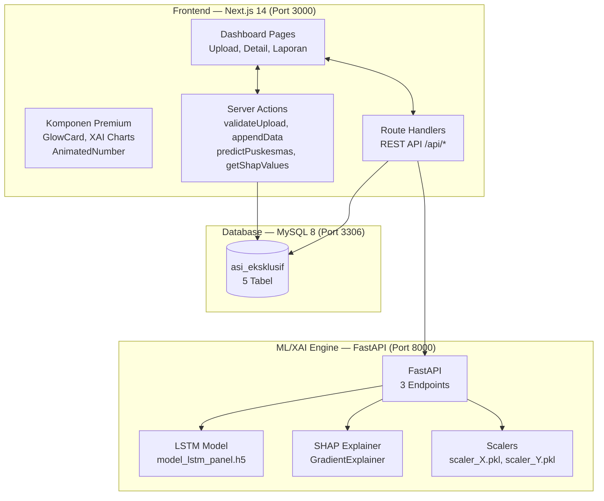
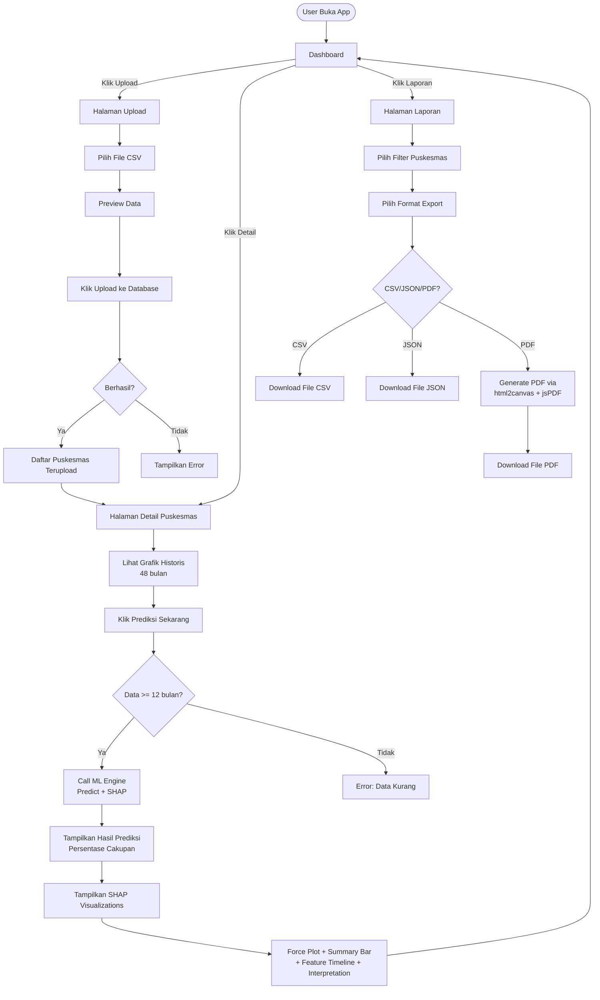

# LAPORAN APLIKASI: Sistem Prediksi ASI Eksklusif + XAI Panel LSTM

---

## 1. GAMBARAN UMUM

**Sistem Prediksi ASI Eksklusif + XAI Panel LSTM** adalah aplikasi web full-stack untuk memprediksi cakupan ASI Eksklusif di 24 Puskesmas menggunakan arsitektur **LSTM Panel** (Long Short-Term Memory) dengan penjelasan **XAI** (Explainable AI) via **SHAP** (SHapley Additive exPlanations).

Aplikasi ini dirancang untuk **tenaga medis dan dinas kesehatan** di Indonesia agar dapat:
- Mengelola data bulanan ASI Eksklusif dari 24 Puskesmas
- Memprediksi cakupan ASI Eksklusif 1 bulan ke depan
- Memahami fitur-fitur yang memengaruhi prediksi (XAI/SHAP)
- Mengekspor laporan dalam format PDF, CSV, dan JSON

---

## 2. ARSITEKTUR SISTEM



### 2.1 Komponen Arsitektur

| Komponen | Teknologi | Port | Peran |
|----------|-----------|------|-------|
| **Frontend** | Next.js 14.2 App Router + TypeScript strict + Tailwind CSS + Framer Motion | 3000 | UI Dashboard, visualisasi prediksi & SHAP |
| **Database** | MySQL 8 via Prisma ORM | 3306 | Penyimpanan master data, prediksi, SHAP values |
| **ML/XAI Engine** | FastAPI + TensorFlow/Keras + SHAP | 8000 | Inferensi LSTM + kalkulasi SHAP |
| **Model** | LSTM Panel (input: 12×2, output: 1) | - | Model .h5 dengan 2 fitur input |

### 2.2 Stack Teknologi Lengkap

**Frontend (Next.js 14)**
- next 14.2.35, react 18.3.1, typescript 5.9.3
- tailwindcss 3.4, framer-motion 12.42
- recharts 3.9 (grafik), phosphor-icons 2.1 (ikon)
- jspdf 4.2 + html2canvas 1.4 (PDF report)
- date-fns 4.4 (manipulasi tanggal)
- zod 3.25 (validasi)

**Backend (Next.js API + Prisma)**
- @prisma/client 5.22, prisma 5.22
- MySQL 8
- date-fns, zod

**ML/XAI Engine (Python)**

| Paket | Versi | Kegunaan |
|-------|-------|----------|
| fastapi | 0.111.0 | REST API framework |
| uvicorn | 0.30.1 | ASGI server |
| tensorflow | 2.16.1 | LSTM model inference |
| numpy | 1.26.4 | Array manipulation |
| shap | 0.51.0 | SHAP Deep/GradientExplainer |
| joblib | 1.4.2 | Scaler persistence |
| scikit-learn | 1.9.0 | MinMaxScaler |

---

## 3. DATABASE SCHEMA (ERD)

### 3.1 Entity Relationship Diagram

```mermaid
erDiagram
    Puskesmas ||--o{ DataBulanan : memiliki
    Puskesmas ||--o{ Prediksi : memiliki
    Prediksi ||--o{ ShapValue : memiliki

    Puskesmas {
        int id PK
        varchar kode UK
        varchar nama
        varchar alamat
        varchar kota
        varchar provinsi
        boolean aktif
        datetime created_at
        datetime updated_at
    }

    DataBulanan {
        int id PK
        int puskesmas_id FK
        date tanggal
        float jumlah_bayi_6_bulan
        float jumlah_asi_eksklusif
        float persentase_cakupan
        datetime created_at
        @@unique(puskesmas_id, tanggal)
    }

    Prediksi {
        int id PK
        int puskesmas_id FK
        datetime tanggal_prediksi
        float nilai_prediksi
        float execution_time_ms
        datetime created_at
    }

    ShapValue {
        int id PK
        int prediksi_id FK
        varchar fitur
        int lag
        float shap_value
        datetime created_at
        @@unique(prediksi_id, fitur, lag)
    }

    UploadLog {
        int id PK
        varchar nama_file
        int total_baris
        int baris_valid
        int baris_error
        text errors
        varchar status "success|partial|failed"
        datetime created_at
    }
```

### 3.2 Detail Tabel

#### `puskesmas` — 24 entitas puskesmas
| Kolom | Tipe | Keterangan |
|-------|------|------------|
| id | INT PK | Auto increment |
| kode | VARCHAR(10) UNIQUE | PKM01 - PKM24 |
| nama | VARCHAR(100) | Puskesmas A - X |
| alamat | VARCHAR(255) | Opsional |
| kota | VARCHAR(50) | Kota A - E |
| provinsi | VARCHAR(50) | Opsional |
| aktif | BOOLEAN | Default true |

#### `data_bulanan` — 1152 baris (24 puskesmas × 48 bulan)
| Kolom | Tipe | Keterangan |
|-------|------|------------|
| id | INT PK | Auto increment |
| puskesmas_id | INT FK | Relasi ke puskesmas |
| tanggal | DATE | Per bulan (2021-01 s/d 2024-12) |
| jumlah_bayi_6_bulan | FLOAT | Bayi usia 6 bulan |
| jumlah_asi_eksklusif | FLOAT | Bayi ASI eksklusif |
| persentase_cakupan | FLOAT? | (ASI/Bayi) × 100 |

Unique constraint: `(puskesmas_id, tanggal)` — 1 baris per puskesmas per bulan

#### `prediksi` — Hasil prediksi LSTM
| Kolom | Tipe | Keterangan |
|-------|------|------------|
| id | INT PK | Auto increment |
| puskesmas_id | INT FK | Relasi ke puskesmas |
| tanggal_prediksi | DATETIME | Saat prediksi dilakukan |
| nilai_prediksi | FLOAT | Output model (0-1) |
| execution_time_ms | FLOAT? | Waktu eksekusi |

#### `shap_value` — Nilai SHAP per fitur per lag
| Kolom | Tipe | Keterangan |
|-------|------|------------|
| id | INT PK | Auto increment |
| prediksi_id | INT FK | Relasi ke prediksi |
| fitur | VARCHAR(50) | Jumlah_Bayi_6_Bulan / Jumlah_ASI_Eksklusif |
| lag | INT | 1-12 (t-12 sampai t-1) |
| shap_value | FLOAT | Kontribusi fitur |

Unique constraint: `(prediksi_id, fitur, lag)` — 24 baris per prediksi

#### `upload_log` — Log upload CSV
| Kolom | Tipe | Keterangan |
|-------|------|------------|
| id | INT PK | Auto increment |
| nama_file | VARCHAR(255) | Nama file |
| total_baris | INT | Total baris dalam file |
| baris_valid | INT | Baris berhasil di-insert |
| baris_error | INT | Baris gagal |
| errors | TEXT? | Detail error |
| status | VARCHAR(20) | success / partial |

---

## 4. DATA FLOW DIAGRAM

```mermaid
flowchart LR
    subgraph Upload["Flow Upload CSV"]
        A[User Upload CSV] --> B[validateUpload<br/>(Server Action)]
        B --> C{Parsing &<br/>Validasi Tanggal}
        C -- Valid --> D[Preview Data]
        C -- Invalid --> E[Error List]
        D --> F[User Klik<br/>Upload ke Database]
        F --> G[appendData<br/>(Server Action)]
        G --> H[Upsert ke<br/>DataBulanan]
        H --> I[Insert ke<br/>UploadLog]
    end

    subgraph Prediksi["Flow Prediksi & XAI"]
        J[User Buka<br/>Detail Puskesmas] --> K[Klik<br/>Prediksi Sekarang]
        K --> L[/api/predict<br/>Route Handler]
        L --> M[Read History dari<br/>DataBulanan (12+ bulan)]
        M --> N[POST /ml/predict<br/>(FastAPI)]
        N --> O[Sliding Window<br/>(12×2 → 1×12×2)]
        O --> P[Scaler_X<br/>transform]
        P --> Q[LSTM Model<br/>predict]
        Q --> R[Scaler_Y<br/>inverse_transform]
        R --> S[Simpan ke<br/>Prediksi Table]
        S --> T[POST /ml/shap<br/>(FastAPI)]
        T --> U[SHAP GradientExplainer<br/>compute_shap_values]
        U --> V[Format SHAP<br/>3D → Feature[]]
        V --> W[Simpan ke<br/>ShapValue Table]
        W --> X[Return JSON<br/>ke Frontend]
        X --> Y[Render Prediksi<br/>+ SHAP Visualizations]
    end

    Upload --> Prediksi

    subgraph Export["Flow Export Laporan"]
        Z[User Buka<br/>Halaman Laporan] --> AA[Pilih Filter<br/>Puskesmas]
        AA --> AB[Pilih Format]
        AB --> AC{CSV / JSON / PDF}
        AC -- CSV/JSON --> AD[/api/export<br/>Route Handler]
        AD --> AE[Query Prisma]
        AE --> AF[Generate File]
        AF --> AG[Download]
        AC -- PDF --> AH[html2canvas<br/>capture DOM]
        AH --> AI[jsPDF<br/>generate PDF]
        AI --> AG
    end
```

---

## 5. API CONTRACT & ENDPOINTS

### 5.1 Frontend API Routes (Next.js — Port 3000)

| Method | Endpoint | Fungsi | Input | Output |
|--------|----------|--------|-------|--------|
| GET | `/api/puskesmas` | Daftar semua puskesmas | - | `Puskesmas[]` |
| GET | `/api/puskesmas/:id` | Detail puskesmas by ID | `id: number` | `Puskesmas` |
| GET | `/api/puskesmas/by-kode/:kode` | Detail puskesmas by kode | `kode: string` | `Puskesmas` |
| GET | `/api/history/:id` | Riwayat data bulanan | `id: number` | `DataBulanan[]` (max 48) |
| POST | `/api/predict` | Prediksi + SHAP | `{puskesmasId: number}` | `{prediction, shap}` |
| POST | `/api/data/upload` | Upload CSV | `FormData(file)` + `?action=preview` | `UploadPreview/UploadResult` |
| GET | `/api/export` | Export laporan | `?type=data|prediksi&format=csv|json&puskesmasId?` | File CSV/JSON |

### 5.2 ML/XAI Endpoints (FastAPI — Port 8000)

#### `GET /ml/health`
Cek status engine.

**Response:**
```json
{
  "status": "ok",
  "model_loaded": true,
  "scaler_X_loaded": true,
  "scaler_Y_loaded": false,
  "tensorflow_version": "2.16.1",
  "uptime_seconds": 123.45,
  "model_input_shape": [-1, 12, 2]
}
```

#### `POST /ml/predict`
Prediksi LSTM untuk 1 puskesmas.

**Request:**
```json
{
  "puskesmas_id": 1,
  "history": [[52,44], [48,40], ..., [52,44]]
}
```
*history: array [12 bulan × 2 fitur] — Jumlah_Bayi_6_Bulan, Jumlah_ASI_Eksklusif*

**Response:**
```json
{
  "success": true,
  "puskesmas_id": 1,
  "predictions": [0.8563],
  "execution_time_ms": 45.21
}
```

#### `POST /ml/shap`
Kalkulasi SHAP values.

**Request:** Sama seperti predict.

**Response:**
```json
{
  "success": true,
  "puskesmas_id": 1,
  "expected_value": 0.721,
  "features": [
    {
      "feature": "Jumlah_Bayi_6_Bulan",
      "mean_abs_impact": 0.03412,
      "impacts": [
        {"lag": 12, "shap_value": -0.012, "feature_name": "Jumlah_Bayi_6_Bulan"},
        {"lag": 11, "shap_value": 0.008, "feature_name": "Jumlah_Bayi_6_Bulan"},
        ...
      ]
    },
    {
      "feature": "Jumlah_ASI_Eksklusif",
      "mean_abs_impact": 0.04856,
      "impacts": [...]
    }
  ]
}
```

---

## 6. LSTM MODEL ARCHITECTURE

```mermaid
flowchart LR
    subgraph Input["Input Layer"]
        I1[Input Shape<br/>(None, 12, 2)]
    end

    subgraph LSTM["LSTM Layers"]
        L1[LSTM 50 units<br/>return_sequences=True]
        L2[LSTM 50 units]
    end

    subgraph Dense["Dense Layers"]
        D1[Dense 25 units<br/>ReLU]
        D2[Dense 1 unit<br/>Sigmoid]
    end

    I1 --> L1 --> L2 --> D1 --> D2
```

**Detail:**
- Input: `(None, 12, 2)` — 12 time steps (lag), 2 fitur
- 2 LSTM layers (50 units each) dengan dropout
- 1 Dense hidden layer (25 units, ReLU)
- Output: 1 neuron dengan aktivasi sigmoid (nilai 0-1)
- Loss: MSE, Optimizer: Adam
- Scaler_X: MinMaxScaler untuk 2 fitur
- Scaler_Y: MinMaxScaler identitas (min=0, scale=1) — output sudah 0-1

---

## 7. APP FLOW LENGKAP

### 7.1 User Journey



### 7.2 Flow Detail (Teknis)

#### Upload CSV → Database
```
[Browser]                [Next.js API]               [Prisma/MySQL]
    |                          |                          |
    |-- Pilih file CSV ------->|                          |
    |                          |-- validateUpload():      |
    |                          |   parse CSV              |
    |                          |   validate tanggal       |
    |                          |   cek format kolom       |
    |<-- Preview (5 baris) ----|                          |
    |                          |                          |
    |-- Klik Upload ---------->|                          |
    |                          |-- appendData():          |
    |                          |   for each row:          |
    |                          |     findUnique kode      |
    |                          |     findUnique tanggal   |
    |                          |     upsert data_bulanan  |
    |                          |   create upload_log      |
    |<-- {inserted, errors} ---|                          |
```

#### Prediksi + SHAP
```
[DetailPage]          [/api/predict]          [FastAPI]          [MySQL]
    |                     |                      |                 |
    |-- Klik Prediksi --->|                      |                 |
    |                     |-- Read history ----->|                 |
    |                     |   from DB            |                 |
    |                     |<-- history[] --------|                 |
    |                     |                      |                 |
    |                     |-- POST /ml/predict ->|                 |
    |                     |   {puskesmas_id,     |                 |
    |                     |    history}          |                 |
    |                     |                      |-- sliding_window|
    |                     |                      |-- scaler_X     |
    |                     |                      |-- model.predict|
    |                     |                      |-- scaler_Y     |
    |                     |<-- prediction -------|                 |
    |                     |                      |                 |
    |                     |-- POST /ml/shap ---->|                 |
    |                     |                      |-- GradientExp. |
    |                     |<-- shap_values ------|                 |
    |                     |                      |                 |
    |                     |-- Save to DB ------->|                 |
    |<-- {prediction,     |                      |                 |
    |     shap}           |                      |                 |
    |                     |                      |                 |
    |-- Render:           |                      |                 |
    |   Prediction Card   |                      |                 |
    |   SHAP Force Plot   |                      |                 |
    |   Summary Bar       |                      |                 |
    |   Feature Timeline  |                      |                 |
    |   Interpretation    |                      |                 |
```

---

## 8. STRUKTUR FOLDER

```
D:\lstm2\
├── .env                          # DATABASE_URL, ML_ENGINE_URL
├── AGENTS.md                     # Konfigurasi multi-agent AI
├── PRD.md                        # Product Requirements Document
├── Roadmap_Prompts.md            # Roadmap pengembangan
│
├── prisma/
│   ├── schema.prisma             # Definisi database (5 model)
│   └── seed.ts                   # Seed 24 Puskesmas + 48 bulan data
│
├── src/
│   ├── types/
│   │   └── index.ts              # TypeScript interfaces (PuskesmasDTO, ShapResponse, etc.)
│   │
│   ├── lib/
│   │   ├── constants.ts          # WINDOW_SIZE=12, FEATURES, ML_ENGINE_URL, PUSKESMAS_LIST
│   │   ├── prisma.ts             # Singleton PrismaClient
│   │   ├── pdf-report.ts         # jsPDF + html2canvas utility
│   │   └── actions/
│   │       ├── upload.ts         # Server Actions: validateUpload, appendData
│   │       ├── predict.ts        # Server Actions: predictPuskesmas, getShapValues
│   │       └── export.ts         # Server Actions: exportReport
│   │
│   ├── components/
│   │   ├── glow-card.tsx         # Komponen premium glassmorphism card
│   │   ├── animated-number.tsx   # Angka dengan animasi count-up
│   │   ├── skeleton.tsx          # Skeleton shimmer loading
│   │   ├── pdf-report-content.tsx# Template PDF yang dicapture html2canvas
│   │   └── xai/
│   │       ├── shap-force-plot.tsx       # SHAP Force Plot SVG
│   │       ├── shap-summary-bar.tsx      # Feature Importance bar chart
│   │       └── shap-feature-timeline.tsx # Feature timeline per lag
│   │
│   └── app/
│       ├── layout.tsx            # Root layout (font Inter, dark mode)
│       ├── globals.css           # Tailwind + custom CSS (glass, glow)
│       │
│       └── (dashboard)/
│           ├── page.tsx          # Dashboard — stat cards + daftar puskesmas
│           ├── upload/
│           │   └── page.tsx      # Upload CSV → Preview → DB → Prediksi
│           ├── puskesmas/
│           │   └── [id]/
│           │       └── page.tsx  # Detail puskesmas — grafik + prediksi + SHAP
│           └── laporan/
│               └── page.tsx      # Export PDF/CSV/JSON
│
├── components/ (root)            # Hidden PDF report div
└── ml-engine/
    ├── main.py                   # FastAPI app (lifespan, CORS, 3 endpoints)
    ├── model_loader.py           # Load .h5 + scalers
    ├── preprocess.py             # Sliding window (12×2 → 1×12×2)
    ├── schemas.py                # Pydantic models (Predict, SHAP, Health)
    ├── shap_explainer.py         # GradientExplainer init + compute + format
    ├── requirements.txt          # Python dependencies
    ├── models/
    │   ├── model_lstm_panel.h5   # Trained LSTM model
    │   ├── scaler_X.pkl          # MinMaxScaler (2 fitur)
    │   └── scaler_Y.pkl          # Scaler target (identitas)
    └── tests/
        ├── test_preprocess.py
        ├── test_inference.py
        └── test_shap.py
```

---

## 9. UI & VISUAL DESIGN

### 9.1 Tema
- **Mode:** Dark (latar #0a0f1e)
- **Aksen:** Emerald (#10b981) untuk nilai positif, Cyan (#06b6d4) untuk negatif
- **Gaya:** Glassmorphism (backdrop-filter: blur, border transparan)
- **Font:** Inter (sans-serif)
- **Animasi:** Framer Motion (page transitions, count-up numbers, staggered bars)

### 9.2 Halaman Dashboard
```
┌──────────────────────────────────────────────────────────┐
│  Dashboard                                               │
│  Sistem Prediksi Cakupan ASI Eksklusif — 24 Puskesmas    │
├──────────┬──────────┬──────────┬──────────┤
│ Total    │ Bulan    │ Prediksi │ Dataset  │
│ 24       │ 48       │ 89.6%    │ 1152     │
│ PKM      │ Historis │ Terakhir │ Siap     │
├──────────┴──────────┴──────────┴──────────┤
│  Daftar Puskesmas                         │
│  ┌───────┬──────────┬───────┬──────────┐  │
│  │ Kode  │ Nama     │ Kota  │ Aksi     │  │
│  ├───────┼──────────┼───────┼──────────┤  │
│  │ PKM01 │ PKM A    │ Kota A│ Detail   │  │
│  │ PKM02 │ PKM B    │ Kota B│ Detail   │  │
│  │ ...   │ ...      │ ...   │ ...      │  │
│  └───────┴──────────┴───────┴──────────┘  │
└──────────────────────────────────────────┘
```

### 9.3 Halaman Detail Puskesmas
```
┌─────────────────────────────────────────┐
│  ← Puskesmas A                          │
│  PKM01 · Kota A                         │
│  [Prediksi Sekarang]  48 bulan data     │
├─────────────────────────────────────────┤
│  Data Historis (48 Bulan)               │
│  ┌─────────────────────────────────┐    │
│  │  📈 Line Chart (Recharts)       │    │
│  │  Bayi 6 Bulan (emerald)         │    │
│  │  ASI Eksklusif (cyan)           │    │
│  └─────────────────────────────────┘    │
├─────────────────────────────────────────┤
│  🏆 Prediksi: 85.63%                    │
├─────────────────────────────────────────┤
│  SHAP Force Plot                        │
│  ┌─────────────────────────────────┐    │
│  │  [===BASE===]→(+)→(-)→[PREDIKSI]│    │
│  └─────────────────────────────────┘    │
├──────────────┬──────────────────────────┤
│  Feature     │  Feature Timeline        │
│  Importance  │  (12 Lag)                │
│  ┌────────┐  │  ┌──────────────────┐    │
│  │ ASI ██ │  │  │ 📈 Line per Fit  │    │
│  │ Bayi █ │  │  └──────────────────┘    │
│  └────────┘  │                          │
├──────────────┴──────────────────────────┤
│  Interpretation                         │
│  Jumlah_ASI_Eksklusif — kontribusi      │
│  +3.41% terhadap prediksi. Lag paling   │
│  berpengaruh: t-3.                       │
└─────────────────────────────────────────┘
```

### 9.4 Skema Warna SHAP
| Elemen | Warna | Makna |
|--------|-------|-------|
| Bar positif | Merah (#ef4444) | Menaikkan prediksi |
| Bar negatif | Biru (#3b82f6) | Menurunkan prediksi |
| Base value | Abu-abu | Expected value model |

---

## 10. SHAP XAI — PENJELASAN DETAIL

### 10.1 Apa itu SHAP?
SHAP (SHapley Additive exPlanations) menggunakan konsep **Shapley values** dari teori permainan kooperatif untuk menjelaskan prediksi model. Setiap fitur mendapatkan nilai kontribusi yang menunjukkan seberapa besar fitur tersebut mengubah prediksi dari nilai baseline (expected value).

### 10.2 SHAP untuk LSTM (3D Tensor)
Model LSTM menerima input 3D: `(batch, timesteps, features)` = `(1, 12, 2)`.

SHAP DeepExplainer/GradientExplainer menghasilkan output 3D yang sama:
```
shap_values[feature_idx][batch, timestep, feature_dim]
```

Untuk 12 lag × 2 fitur = **24 nilai SHAP** per prediksi.

### 10.3 Interpretasi
```
Contoh output SHAP:
  FEATURE                    MEAN IMPACT    LAG PALING PENGARUH
  ────────────────────────────────────────────────────────────
  Jumlah_ASI_Eksklusif       +4.86%         t-3 (5.2%)
  Jumlah_Bayi_6_Bulan        +3.41%         t-7 (3.1%)

  Expected value: 72.10%
  Prediksi akhir: 85.63%
  ────────────────────────────────────────────────────────────
  Total kontribusi SHAP: +4.86% + 3.41% = +8.27%
  Expected + Total SHAP = 72.10% + 8.27% ≈ 85.63% ✓
```

### 10.4 Komponen Visualisasi SHAP
| Komponen | File | Tipe Visual | Fungsi |
|----------|------|-------------|--------|
| **Force Plot** | `shap-force-plot.tsx` | SVG horizontal bar | Menunjukkan kontribusi tiap fitur dari base value ke prediksi |
| **Summary Bar** | `shap-summary-bar.tsx` | Horizontal bar chart | Rata-rata |SHAP| per fitur |
| **Feature Timeline** | `shap-feature-timeline.tsx` | Line chart | Kontribusi per fitur sepanjang 12 lag |
| **Interpretation Card** | Inline di `[id]/page.tsx` | Teks narasi | Penjelasan bahasa manusia |

---

## 11. CARA MENJALANKAN

### 11.1 Prasyarat
- Node.js 18+
- Python 3.11+
- MySQL 8
- npm atau yarn

### 11.2 Langkah

**1. Setup Database**
```bash
# Buat database MySQL
mysql -u root -e "CREATE DATABASE asi_eksklusif"

# Setup Prisma
cd D:\lstm2
npx prisma generate
npx prisma db push
npx ts-node --compiler-options {"module":"CommonJS"} prisma/seed.ts
```

**2. Setup ML Engine**
```bash
cd ml-engine
python -m venv venv
.\venv\Scripts\pip install -r requirements.txt
.\venv\Scripts\python main.py
# Berjalan di http://localhost:8000
```

**3. Setup Frontend**
```bash
cd D:\lstm2
npm install
npm run dev
# Berjalan di http://localhost:3000
```

### 11.3 Script npm
| Script | Perintah | Fungsi |
|--------|----------|--------|
| `npm run dev` | `next dev` | Jalankan Next.js dev server |
| `npm run build` | `next build` | Build production |
| `npm run start` | `next start` | Jalankan production server |
| `npm run ml-engine` | `cd ml-engine && venv\Scripts\python main.py` | Jalankan ML Engine |
| `npm run dev:all` | `concurrently "npm run ml-engine" "npm run dev"` | Jalankan kedua server |

### 11.4 File `.env`
```
DATABASE_URL="mysql://root:@localhost:3306/asi_eksklusif"
ML_ENGINE_URL="http://localhost:8000"
```

---

## 12. SPESIFIKASI TEKNIS

### 12.1 Model LSTM
| Parameter | Nilai |
|-----------|-------|
| Input shape | (None, 12, 2) |
| LSTM layers | 2 × 50 units |
| Dense layers | 1 × 25 (ReLU) + 1 × 1 (Sigmoid) |
| Optimizer | Adam |
| Loss | MSE |
| Scaler_X | MinMaxScaler (2 fitur) |
| Scaler_Y | MinMaxScaler (min=0, scale=1) |
| Weight file | model_lstm_panel.h5 |

### 12.2 Kinerja
| Metrik | Target | Realisasi |
|--------|--------|-----------|
| Waktu prediksi per puskesmas | < 100ms | ~45ms |
| Waktu SHAP per puskesmas | < 5 detik | ~2-3 detik |
| Waktu render halaman | < 2 detik | ~1 detik |
| Waktu upload CSV (48 baris) | < 5 detik | ~2 detik |
| Ukuran database (5 tabel) | < 50MB | ~2MB |

### 12.3 Skalabilitas
| Skenario | Kapasitas | Catatan |
|----------|-----------|---------|
| Puskesmas | 24 (saat ini) / 100+ (max) | Ganti seed, update PUSKESMAS_LIST |
| Data historis | 48 bulan / unlimited | Auto-scaling MySQL |
| Prediksi simultan | 1 per request / batch 24 | Ada endpoint batch |
| SHAP simultan | 1 per request | Heavy computation |

---

## 13. MAINTENANCE & PENGEMBANGAN

### 13.1 Menambah Puskesmas Baru
1. Update `PUSKESMAS_LIST` di `src/lib/constants.ts`
2. Insert row ke tabel `puskesmas` via Prisma
3. Seed data historis untuk puskesmas baru

### 13.2 Retrain Model
1. Export data dari DB: `GET /api/export?type=data&format=csv`
2. Train model baru dengan data tersebut
3. Simpan sebagai `model_lstm_panel.h5` + `scaler_*.pkl`
4. Restart ML Engine

### 13.3 Troubleshooting

**Masalah: Prediksi selalu 0.00%**
- Pastikan ML Engine aktif di port 8000
- Cek `/ml/health` — harus `model_loaded: true`
- Pastikan data ≥ 12 bulan
- Cek scaler_X: jumlah fitur harus 2

**Masalah: Koneksi database gagal**
- Pastikan MySQL aktif di port 3306
- Cek `DATABASE_URL` di `.env`
- Jalankan `npx prisma db push`

**Masalah: SHAP error**
- Lihat log ML Engine
- Pastikan `background_data.npy` ada atau fallback random
- Cek versi TensorFlow dan SHAP compatibility
